<div align="center">

# 🏠 Zuhause

**Das ganze Haus in 3D planen – und jedes Fach jedes Möbels ist ein Lagerplatz.**

Hausplaner, Heimlager und Einkaufsliste in einer selbst gehosteten Web-App – am PC, auf dem Handy und am Wandtablet.

[](https://nodejs.org)
[](#mit-docker-empfohlen)
[](#ki-assistent)
[](LICENSE)
[](https://mupf-dev.github.io/Homemgmt/)

[Funktionen](#funktionen) · [Wandterminal](#wandterminal) · [Live-Wetter](#live-wetter) · [Ein echtes Haus](#ein-echtes-haus) · [Installation](#installation) · [Anleitung](#anleitung) · [Betrieb](#betrieb) · [Entwicklung](#entwicklung)

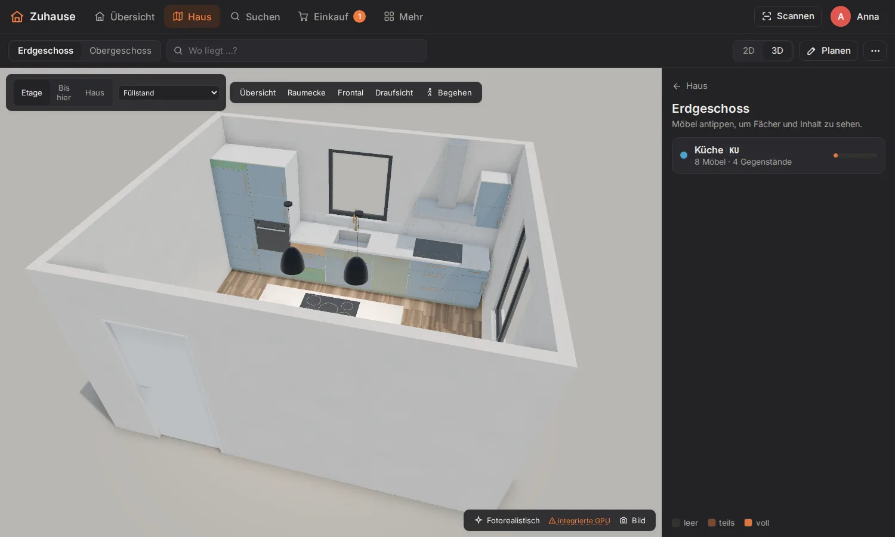

</div>

## Worum geht's?

Wo liegen die Batterien? Ist noch Spülmittel da? Was läuft diese Woche ab? **Zuhause** beantwortet das, indem es dein
Haus abbildet: Du zeichnest Etagen, Wände und Räume, stellst Möbel hinein – und jedes Fach, jede Schublade wird
automatisch ein **Lagerplatz** mit eigener Adresse (`KU-C2` = Küche, Möbel C, Fach 2). Gegenstände buchst du per
Klick, QR-Scan, Sprache oder KI-Assistent ein und aus. Die Suche „Wo liegt …?“ lässt die Treffer im Haus aufleuchten.

Alles läuft auf deinem eigenen Rechner oder Server: **ein** Node-Prozess, **eine** SQLite-Datei, keine Cloud.

## Funktionen

<table>
<tr>
<td width="50%">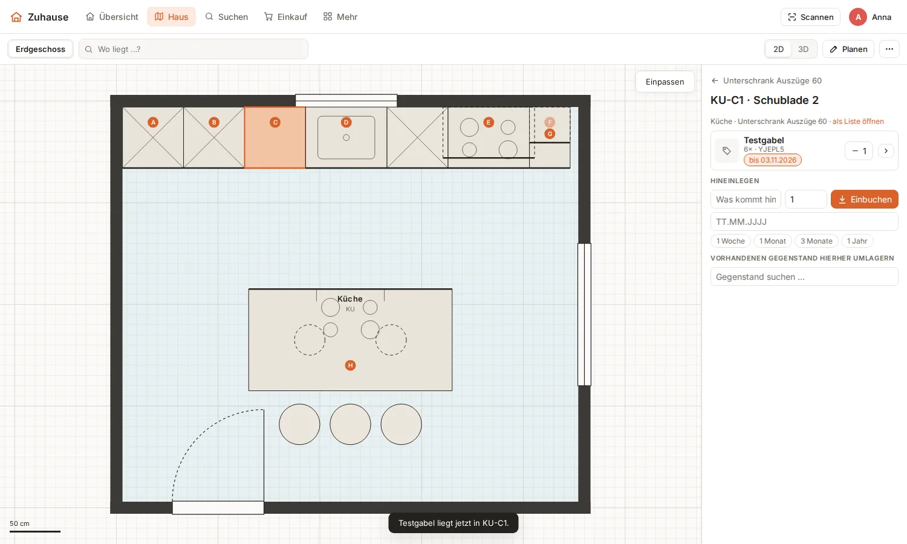</td>
<td width="50%">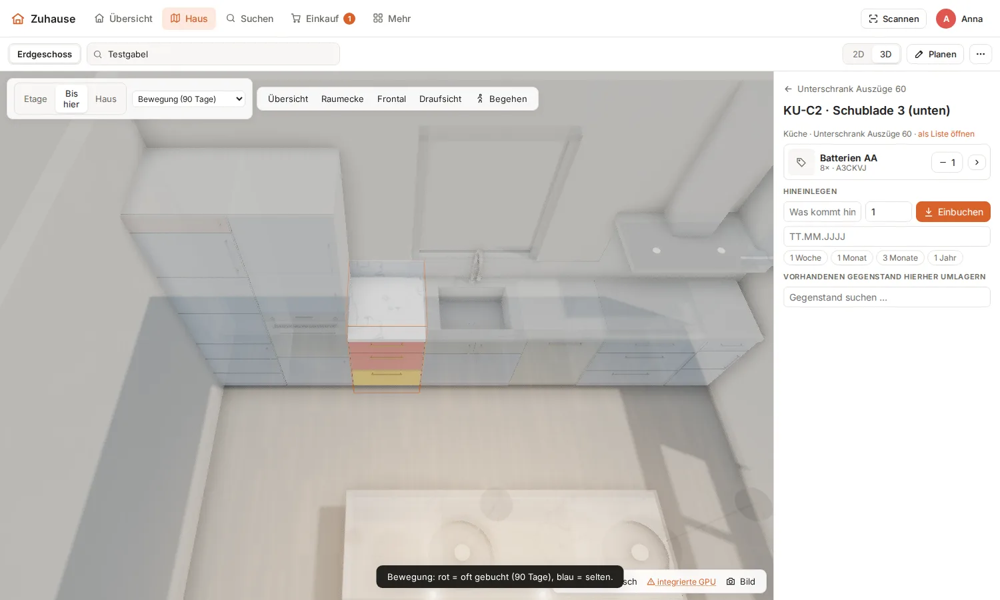</td>
</tr>
<tr>
<td><b>Lager im Plan:</b> Möbel antippen zeigt die Fächer, ein Fach seinen Inhalt – einbuchen, entnehmen, umlagern.</td>
<td><b>Lager in 3D:</b> Fächer nach Füllstand, Haltbarkeit oder Bewegung (Heatmap) eingefärbt.</td>
</tr>
<tr>
<td>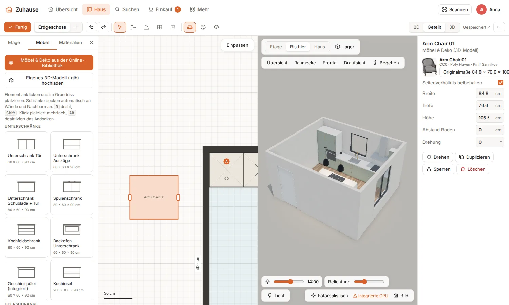</td>
<td>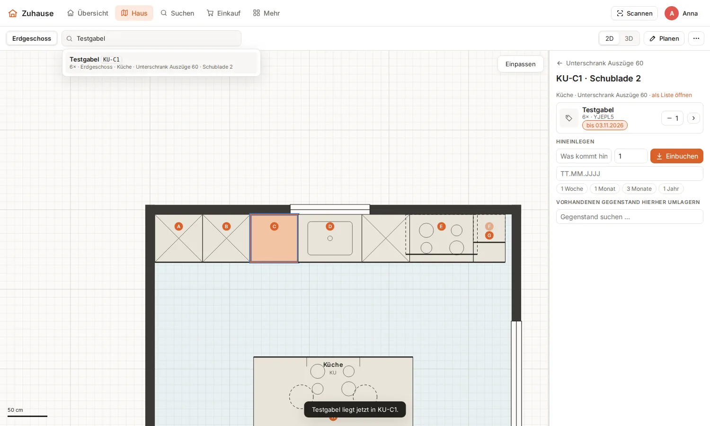</td>
</tr>
<tr>
<td><b>Hausplaner:</b> Wände zeichnen oder Grundriss nachzeichnen, Möbelkatalog, 3D-Modelle aus Online-Bibliotheken.</td>
<td><b>„Wo liegt …?“:</b> Suche über alle Lager, Treffer leuchten im Haus auf.</td>
</tr>
</table>

### 🏗️ Haus planen

- **Etagen** – Erdgeschoss, Obergeschoss, Keller, Dachgeschoss und Außenbereich, die Etage darunter als Zeichenhilfe
- **Wände** mit Fang und Maßen, Türen, Fenster, Treppen; Grundriss als Bild hochladen und nachzeichnen
- **Räume** per Klick in eine umschlossene Fläche – jeder Raum wird ein Lager mit Kürzel (Küche → `KU`)
- **Möbelkatalog**: Küchenschränke, Regale, Schwerlastregal, Vorrats- und Kleiderschrank, Sideboard, Kommode, Werkbank
- **Objektbibliothek**: eigene Möbelarten im Editor bauen (Spalten, Schubladen, Türen mit Böden, offene Fächer – oder
  ein eigenes 3D-Modell mit Fächern) und aus dem **Community-Katalog** ([homemgmt-object-library](https://mupf-dev.github.io/homemgmt-object-library/)) installieren; jedes Fach
  wird ein Lagerplatz
- **3D-Modelle** von [Poly Haven](https://polyhaven.com) (CC0) und FurniMesh suchen und einsetzen, eigene `.glb` hochladen
- **3D-Ansicht** mit PBR-Materialien, Tageslicht nach Uhrzeit, **fotorealistischem Pathtracing** und **Begehen** wie
  im Spiel (inklusive Treppen zwischen den Etagen)
- **Lage des Hauses**: Adresse oder Koordinaten und Nordrichtung – die Sonne steht wie draußen

### 📦 Lager

- **Ein-/Ausbuchen, Umlagern, Rückgängig** mit vollständigem Verlauf je Gegenstand
- **QR-Scan** mit der Handykamera: Fach-Code + Gegenstand = einbuchen, Gegenstand zweimal = ausbuchen
- **Etiketten & QR-Schilder** zum Drucken – oder als 3D-Druckmodell (STL/3MF, auch mehrfarbig)
- **Einkaufsliste**: Verbrauchsmaterial landet beim Ausbuchen automatisch drauf, teilen per WhatsApp
- **Haltbarkeit** mit Warnungen, **Behälter** (Kiste in der Werkzeugkiste), **Fotos** je Gegenstand
- **Auswertung**, **Export/Import** als Excel, **automatische Backups**
- **Offline-fest**: Buchungen bei schlechtem WLAN werden vorgemerkt und automatisch nachgebucht

### 📱 Am Handy

<table>
<tr>
<td align="center" width="50%">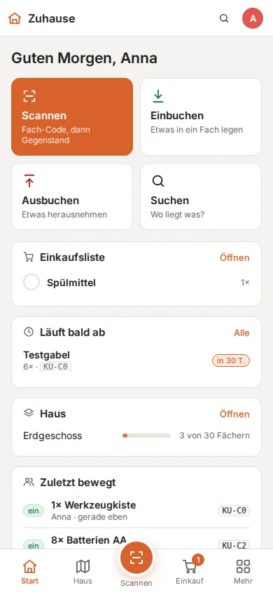</td>
<td align="center" width="50%">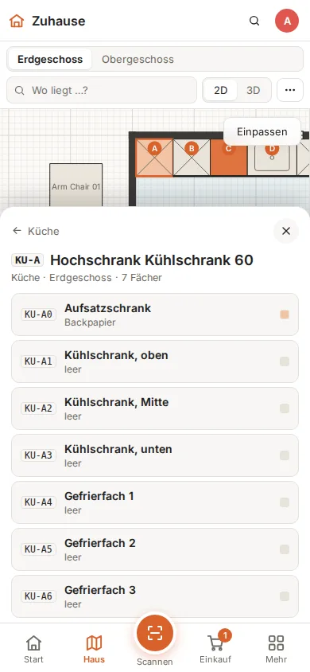</td>
</tr>
<tr>
<td align="center">Übersicht: Schnellaktionen, Einkauf, Ablaufendes</td>
<td align="center">Fach als Blatt von unten</td>
</tr>
</table>

- **Als App installierbar** (PWA) mit Schnellzugriffen; am Handy Leiste unten, **Scannen** in der Mitte
- **Übersicht** als Startseite: Schnellaktionen, Einkaufsliste zum Abhaken, was bald abläuft, Füllstand je Etage, zuletzt bewegt
- **Schlechtes WLAN**: Buchungen werden vorgemerkt („2 Buchungen warten“) und automatisch nachgebucht – der Server bucht nie doppelt
- **Mehrere Personen** mit Anmeldung per Kachel + PIN/Passwort oder E-Mail, Recht „Haus planen“ pro Person
- **Einstellungen pro Person**: Startseite, Haus zuerst in 2D oder 3D, Hell/Dunkel, Schriftgröße

<a id="wandterminal"></a>

### 🖥️ Wandterminal

Ein Tablet an der Wand wird zur Schaltzentrale für alle im Haus – ohne persönliche Anmeldung.

<table>
<tr>
<td width="50%">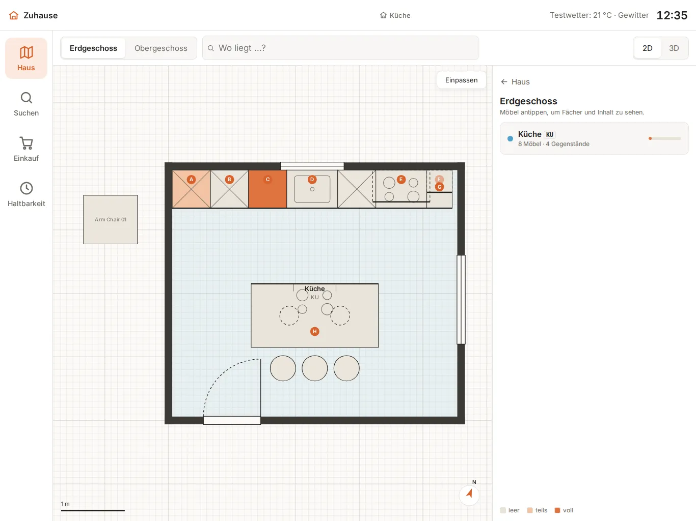</td>
<td width="25%">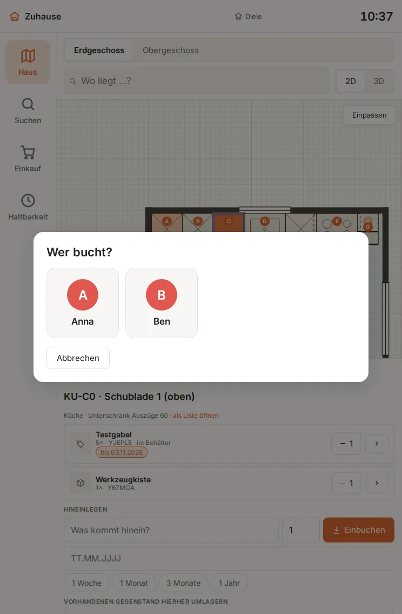</td>
<td width="25%">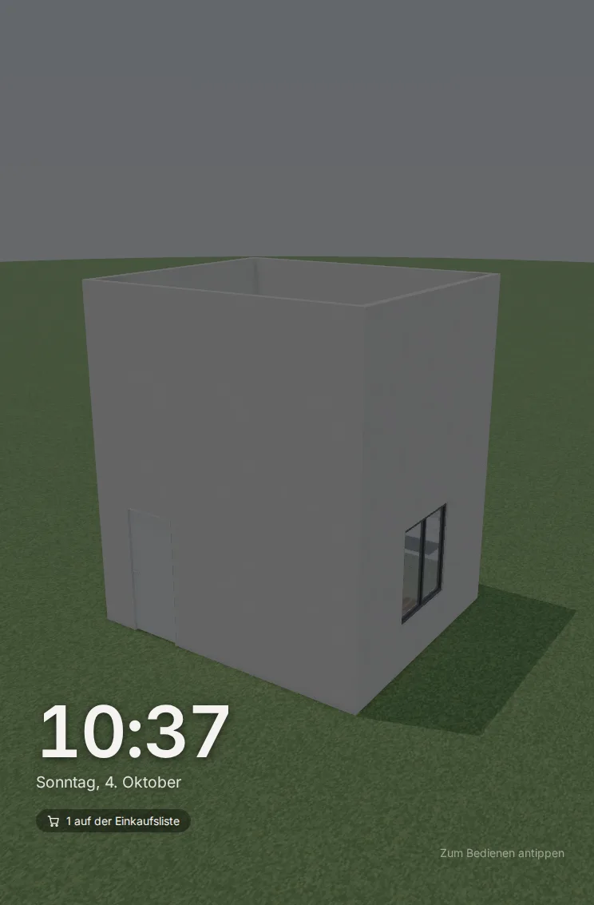</td>
</tr>
<tr>
<td>Querformat: Navigation am linken Rand, Wetter und Uhr oben</td>
<td>„Wer bucht?“</td>
<td>Ruhezustand</td>
</tr>
</table>

- **Einrichten:** *Verwaltung → Wandterminals → Wandterminal anlegen*, den **Einrichtungslink** oder seinen **QR-Code**
  am Tablet öffnen – kein Passwort am Gerät. Link jederzeit neu erzeugen oder Terminal entfernen.
- **Je Gerät einstellbar:** Hoch- oder Querformat, Haus als Grundriss oder 3D, hell/dunkel, Schriftgröße bis „sehr groß“,
  Minuten bis zurück zum Haus, Ruhezustand an/aus, Detailgrad (Entwurf 15 s, Normal 30 s, Hoch 90 s), Postleitzahl fürs Wetter.
- **Buchen für alle:** Fach antippen, einbuchen oder entnehmen, dann auf die eigene **„Wer bucht?“**-Kachel tippen; die
  Person bleibt 90 Sekunden gemerkt. Große Touch-Flächen; nur Haus, Suchen, Einkauf und Haltbarkeit – Planen ist gesperrt.
- **Ruhezustand:** das Haus gedimmt und fotorealistisch mit Rasen, große Uhr, Datum, Wetter, Einkaufsliste und
  Ablaufendes. Sparsam: rechnet nur neu, wenn sich Sonne oder Wetter ändern, pausiert bei verdecktem Bildschirm.

<a id="live-wetter"></a>

### 🌦️ Live-Wetter am Haus

<table>
<tr>
<td width="20%">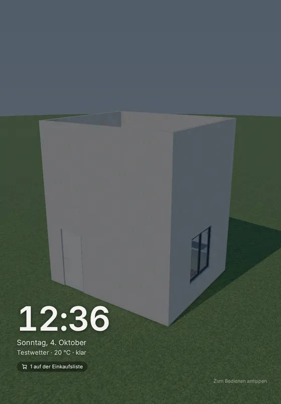</td>
<td width="20%">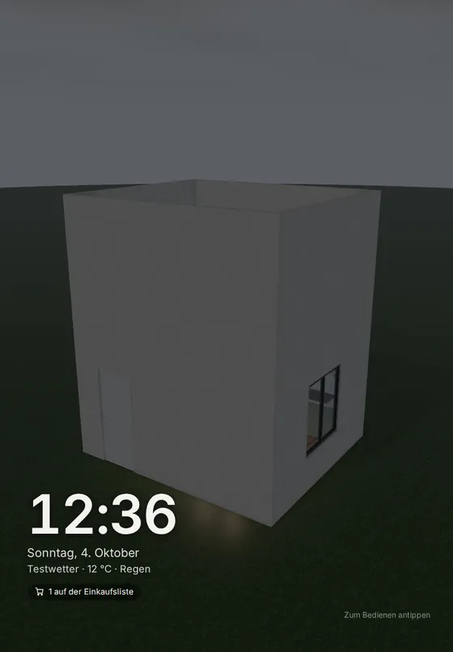</td>
<td width="20%">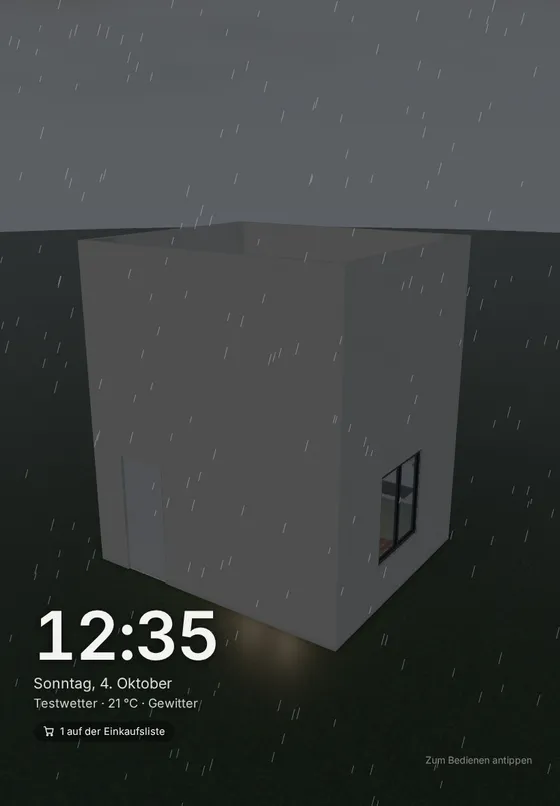</td>
<td width="20%">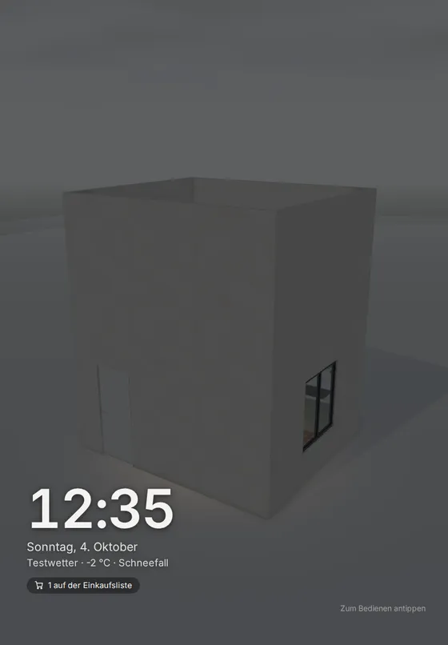</td>
<td width="20%">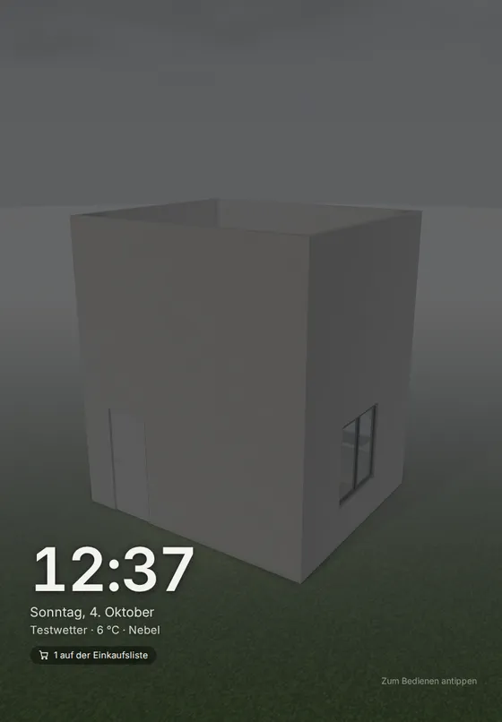</td>
</tr>
<tr>
<td align="center">Klar</td><td align="center">Regen</td><td align="center">Gewitter</td><td align="center">Schnee</td><td align="center">Nebel</td>
</tr>
</table>

Mit der **Lage des Hauses** (*Planen → ⋯*: Adresse, Postleitzahl oder Koordinaten, Nordrichtung per Kompass) zeigt das
Wandterminal das Haus so, wie es draußen aussieht – ohne Konto und ohne API-Schlüssel:

- **Sonne wie draußen:** Sonnenstand aus Ort und Uhrzeit; Himmel und Licht laufen jede Minute mit – Tag, Dämmerung,
  Nacht mit eingeschalteten Lampen und Mondlicht. Der Grundriss zeigt einen Nordpfeil.
- **Wolken** nach echter Bedeckung, Farbe nach Tageszeit, ziehen mit dem Wind – auch im fotorealistischen Bild.
- **Regen und Niesel** als dezente Animation nach echter Regenrate (mm/h), der Rasen wird nass; **Nebel und Dunst**
  nach Sichtweite; Temperatur und Regenmenge in der Kopfzeile.
- **Schnee** wächst als Fleck: erst auf und vor der Terrasse, ab ~10 cm der ganze Garten; das Dach wird angezuckert bis weiß.
- **Gewitter in Echtzeit:** jeder Blitzeinschlag im Umkreis kommt sofort an ([Blitzortung.org](https://www.blitzortung.org),
  per Server-Sent Events). Nahe Blitze (≤ 30 km) lassen den Bildschirm aufblitzen, ab 20 km warnt die Kopfzeile, im
  Ruhezustand stehen der letzte Blitz (Entfernung, Richtung, Alter) und eine **Blitzkarte** (10/25/50 km).
- **Testwetter** zum Ausprobieren: Terminal-Adresse mit `?testwetter=schnee` öffnen (auch `schnee-hauch`, `schneesturm`,
  `niesel`, `regen`, `wolkenbruch`, `gewitter`, `nebel`, `wolkig`, `klar`) – die Bilder oben sind so entstanden.

Daten: Ort über [OpenStreetMap](https://www.openstreetmap.org), Wetter über [Open-Meteo](https://open-meteo.com) (alle 15 Minuten).

<a id="ki-assistent"></a>

### 🤖 KI-Assistent und MCP-Server

- **Assistent in der App** per Text, Sprache oder Foto: *„3 Dosen Tomaten auf Keller B2, haltbar bis 05/2027“* –
  bucht selbst, jede Buchung mit „rückgängig“. Jede OpenAI-kompatible Schnittstelle (z. B. OpenRouter).
- **MCP-Server** für KI-Assistenten wie Claude: suchen, ein-/ausbuchen, umlagern, Einkaufsliste – angemeldet per API-Schlüssel

## Ein echtes Haus

Zuhause ist für ein echtes Einfamilienhaus entstanden – mit Keller, Erdgeschoss, Obergeschoss, Dachboden und
Außenbereich. Diese Bilder zeigen den Plan dieses Hauses (Stand einer früheren Version der Oberfläche).

<table>
<tr>
<td width="50%">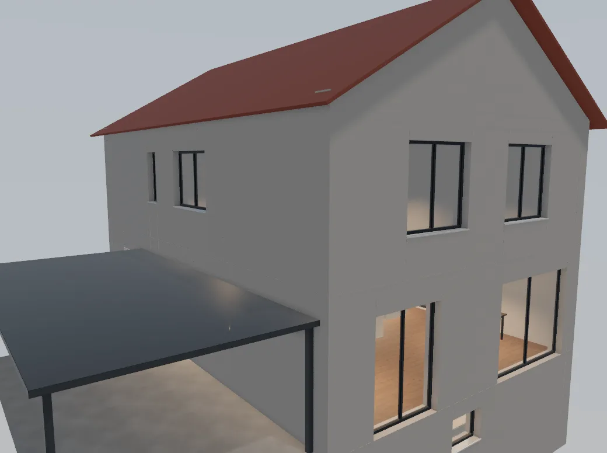</td>
<td width="50%"></td>
</tr>
<tr>
<td><b>Außen:</b> Satteldach, Fenster, Carport und Terrasse – alle Etagen übereinander.</td>
<td><b>Erdgeschoss:</b> Küchenzeile mit Hochschränken, Kochinsel, Treppe und Wohnbereich.</td>
</tr>
<tr>
<td>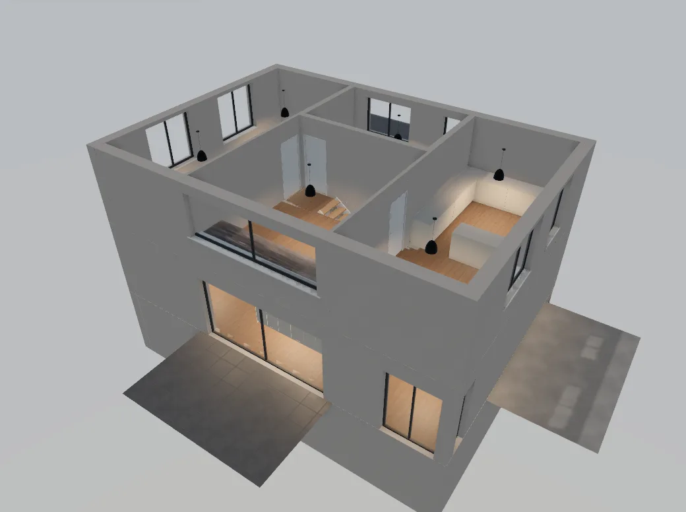</td>
<td>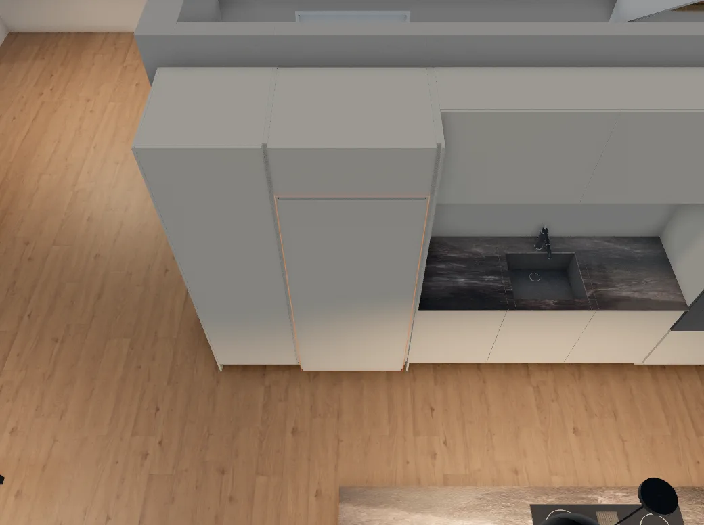</td>
</tr>
<tr>
<td><b>Obergeschoss:</b> „Bis hier“ zeigt die Etage samt allem darunter.</td>
<td><b>Küche:</b> grifflose Fronten, Durchgang in Schrankoptik, Steinarbeitsplatte.</td>
</tr>
<tr>
<td>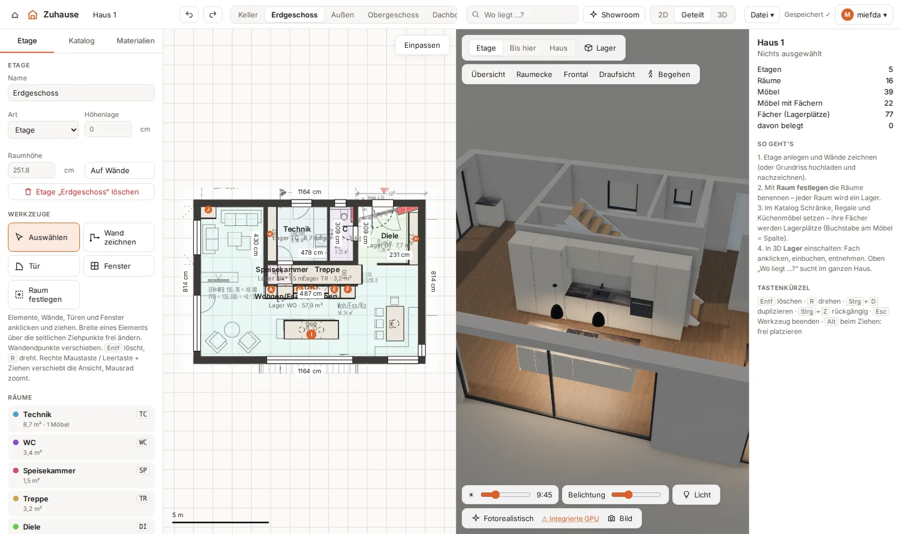</td>
<td>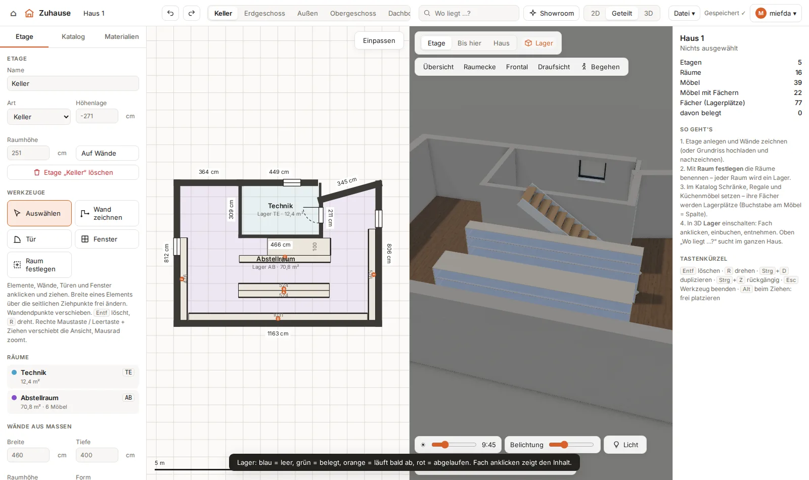</td>
</tr>
<tr>
<td><b>Grundriss:</b> über dem eingescannten Bauplan nachgezeichnet, Räume als Lager.</td>
<td><b>Keller:</b> Regale im Abstellraum als Lagerplätze, nach Füllstand eingefärbt.</td>
</tr>
</table>

## Installation

### Mit Docker (empfohlen)

```bash
git clone https://github.com/mupf-dev/Homemgmt.git
cd Homemgmt
docker compose up -d --build
```

Danach läuft die App unter **http://localhost:3000** (MCP-Server: Port 3100). Die Daten liegen im Volume `zuhause-data`
(`/data` im Container: `zuhause.db`, `backups/`, `library/`). Einstellungen nimmst du in der
[`docker-compose.yml`](docker-compose.yml) vor – die wichtigsten stehen dort schon auskommentiert.

### Ohne Docker

Benötigt **Node.js ≥ 22.18** (eingebautes `node:sqlite`, TypeScript läuft auf dem Server ohne Build).

```bash
git clone https://github.com/mupf-dev/Homemgmt.git
cd Homemgmt
npm install
npm run build && npm start     # → http://localhost:3000
```

### Erster Start

Bei leerer Datenbank zeigt die App die **Ersteinrichtung**: „Neue Person“ antippen, Name und Passwort vergeben – diese
Person wird **Admin**. Danach meldet man sich per Kachel + Passwort/PIN oder mit E-Mail an. Weitere Personen legst du
unter *Mehr → Verwaltung → Personen* an; Selbst-Registrierung ist standardmäßig aus.

> [!TIP]
> Für den **Kamera-Scan** auf dem Handy braucht der Browser HTTPS. Im Heimnetz genügt `npm run cert` (selbst signiertes
> Zertifikat, App dann unter `https://<rechner>:3443`), dauerhaft ist ein [Reverse Proxy](#hinter-einem-reverse-proxy) besser.

## Anleitung

### 1. Haus anlegen

1. **Haus** öffnen → **Planen** (nur am PC). Oben die Etagen-Reiter, **+** legt Obergeschoss, Keller, Dachgeschoss
   oder Außenbereich an.
2. **Wände** zeichnen – oder unter *Etage → Grundriss-Vorlage* einen Scan/ein Foto des Grundrisses hochladen, Maßstab
   kalibrieren und nachzeichnen. Für einfache Räume: *Wände aus Maßen*.
3. **Raum festlegen** und in eine umschlossene Fläche klicken. Jeder Raum wird ein **Lager** mit Kürzel.
4. **Möbel** aus dem Katalog setzen; Schränke docken an Wände und Nachbarn an (`R` dreht, `Alt` platziert frei).
   Jedes Möbel mit Fächern bekommt einen **Buchstaben**, jedes Fach einen **Lagerplatz**: `KU-B2`.
5. **Fertig** – der Plan wird automatisch gespeichert und mit allen geteilt.

### 2. Dinge einlagern und finden

- **Ansehen** ist der Normalfall: Möbel antippen → Fächer, Fach antippen → Inhalt, **Einbuchen** oder **− 1** zum Entnehmen.
- In 3D färbt **Lager** die Fächer nach Füllstand: blau leer, grün belegt, orange läuft ab, rot abgelaufen.
- **„Wo liegt …?“** oben durchsucht alle Lager; Treffer leuchten im Grundriss und in 3D, Etagen mit Treffern bekommen einen Punkt.
- Am Handy: **Scannen** in der Mitte der Leiste. Erst den Fach-Code, dann den Gegenstand scannen = einbuchen;
  denselben Gegenstand zweimal = ausbuchen. Unbekannte, vorgedruckte Etiketten legen einen neuen Gegenstand an.

### 3. Etiketten drucken

*Mehr → Etiketten & QR-Schilder*: Etiketten für Fächer, Gegenstände oder **leere Etiketten** zum Vorab-Aufkleben (groß
7 × 3,6 cm oder klein 5 × 2,5 cm). In der Platz- und Objektansicht erzeugt **3D-Druck** ein QR-Schild als STL oder
mehrfarbiges 3MF – komplett im Browser.

### 4. Einkaufsliste und Haltbarkeit

Gegenstände als **Verbrauchsmaterial** markieren – beim Ausbuchen landen sie auf der **Einkaufsliste**. Dort
abhaken – oder gekauft und gleich wieder an den bisherigen Platz einbuchen. Mit **Haltbarkeitsdatum** erscheinen sie rechtzeitig unter *Läuft bald ab*.

### 5. Wandterminal einrichten

*Verwaltung → Wandterminals → Wandterminal anlegen*: Hoch- oder Querformat wählen, dann den **Einrichtungslink** (oder seinen QR-Code) am Tablet öffnen. Das
Terminal braucht keine persönliche Anmeldung; beim Buchen fragt es **„Wer bucht?“**. Ohne Bedienung wechselt es in den
Ruhezustand – mit **Lage des Hauses** (*Planen → ⋯*) samt Sonne, Himmel und Wetter wie draußen. Blitzt es in der
Nähe, zeigt das Terminal eine Warnung und eine Blitzkarte. Zum Ausprobieren: Adresse mit `?testwetter=schnee`
(oder `regen`, `gewitter`, `nebel` …) öffnen.

### 6. KI-Assistent und MCP-Server

**Assistent:** *Verwaltung → Assistent* – Adresse einer OpenAI-kompatiblen Schnittstelle (Standard
`https://openrouter.ai/api/v1`), Modell (mit Tool Calling, für Fotos mit Bildern) und API-Schlüssel eintragen,
*Verbindung testen*. Der Schlüssel bleibt auf dem Server.

**MCP:** *Verwaltung → API-Schlüssel* einen Schlüssel anlegen („Lesen und buchen“ oder „Nur lesen“), dann z. B. in
Claude Code:

```bash
claude mcp add --transport http zuhause http://localhost:3100/mcp --header "Authorization: Bearer hlk_…"
```

Das vollständige Handbuch für alle Lagerfunktionen steht in **[docs/LAGER.md](docs/LAGER.md)**, der Planer in
[docs/KUECHE.md](docs/KUECHE.md), Hintergründe in [ARCHITEKTUR.md](ARCHITEKTUR.md) und Neuerungen im [CHANGELOG](CHANGELOG.md).

## Betrieb

### Umgebungsvariablen

| Variable | Standard | Bedeutung |
|----------|----------|-----------|
| `PORT` | `3000` | HTTP-Port |
| `HTTPS_PORT` | `3443` | HTTPS (nur mit Zertifikat in `CERT_DIR`, `npm run cert`), `0` = aus |
| `DB_PATH` | `data/zuhause.db` | Datenbank; Backups und Texturen liegen daneben |
| `MCP_PORT` / `MCP_HOST` / `MCP_PUBLIC_URL` | `3100` / `0.0.0.0` / – | MCP-Server (`MCP_PORT=0` = aus) |
| `TRUST_PROXY` | – | `1` hinter einem Reverse Proxy (Secure-Cookie, echte Client-IP) |
| `BACKUP_INTERVAL_HOURS` / `BACKUP_KEEP` | `24` / `14` | automatische Backups |
| `AI_API_KEY` / `AI_BASE_URL` / `AI_MODEL` | – | KI-Assistent (sonst unter *Verwaltung → Assistent*) |
| `LIGHTNING` | – | `0` schaltet die Live-Blitze (Blitzortung.org) für Wandterminals ab |
| `OBJECT_CATALOG_URL` | `https://mupf-dev.github.io/homemgmt-object-library/` | Community-Katalog der Objektbibliothek (eigener Fork oder lokaler Spiegel) |

Weitere Variablen (z. B. `MCP_ALLOWED_ORIGINS`, `PUBLIC_URL`) stehen in [docs/LAGER.md](docs/LAGER.md).

### Hinter einem Reverse Proxy

Für den dauerhaften Betrieb mit HTTPS (Caddy, nginx, Traefik …) die App auf Port 3000 weiterleiten und `TRUST_PROXY=1`
setzen. Den MCP-Server nur bei Bedarf veröffentlichen und dort das Puffern ausschalten (Caddy `flush_interval -1`,
nginx `proxy_buffering off`). Details: [docs/LAGER.md](docs/LAGER.md#hinter-einem-reverse-proxy-empfohlen).

### Backups und Passwort vergessen

Backups entstehen automatisch (Standard alle 24 h, 14 werden behalten) und lassen sich unter *Verwaltung → Backups*
anlegen, herunterladen und wiederherstellen. Passwort zurücksetzen:

```bash
npm run reset-password -- anna                                             # ohne Docker
docker compose exec zuhause node scripts/reset-password.cjs anna           # mit Docker
```

### Bestehende Daten übernehmen

Aus den Vorgängerprojekten **Heimlager** und **Küchenplaner** (die Quellen werden nur gelesen):

```bash
npm run migrate -- --lager ../inventory/data/lager.db --kueche ../küchenplaner/data/kuechenplaner.db
```

Konten mit gleicher E-Mail oder gleichem Namen werden zu einer Person (sonst `--map mail@example.de=Name`). In der App
holt das Kontomenü **„Gespeicherte Planungen übernehmen“** eine Küchenplanung als Etage ins Haus. Für den Hausgrundriss
eines laufenden Heimlagers gibt es `npm run import-prod` (siehe Kopf von [`scripts/import-prod.ts`](scripts/import-prod.ts)).

Eine migrierte Datenbank in den Docker-Container kopieren:

```bash
docker compose create
docker compose cp ./data/zuhause.db zuhause:/data/zuhause.db
docker compose cp ./data/library zuhause:/data/library
docker compose run --rm -u root --entrypoint chown zuhause -R node:node /data
docker compose up -d
```

## Entwicklung

```bash
npm run dev          # ein Prozess, App mit Vite-HMR → http://localhost:3000
npm test             # API-Tests, jeder mit eigenem Server und frischer Datenbank
npm run typecheck    # App und Server
npm run test:e2e     # Klicktest im Browser (einmalig: npm install --no-save playwright-core)
```

### Aufbau

```
server/index.ts            Einstieg: Express, Module, HTTPS, MCP
server/lager/              Lager: Konto, Lager, Buchungen, Assistent, MCP, Backups
server/haus/               Haus: Hausplan speichern, Abgleich mit dem Lager
server/kueche/             Planungen, Benutzerverwaltung, Materialbibliothek
web/app/src/model/         Hausmodell für App und Server: Typen, Katalog, Geometrie, Räume, Fächer
web/app/src/               App: Editor (plan2d), 3D (scene3d, models, materials), Zustand, Konto
scripts/                   migrate, reset-password, make-cert, make-icons, import-prod
test/                      node:test, e2e/ Klicktest im Browser
docs/                      Handbücher und Changelogs der Ursprungsprojekte
site/                      Projekt-Website (GitHub Pages) und Screenshots
```

**Technik:** Express 5, eingebautes `node:sqlite`, TypeScript (Server per Type Stripping ohne Build), Vite, three.js,
three-gpu-pathtracer.

### API (Haus)

| Methode | Pfad | Zweck |
|---------|------|-------|
| GET | `/api/house` | Hausplan `{house, version, can_edit, reserved}` |
| PUT | `/api/house` | Speichern `{house, base_version}` → normalisierter Plan, Abgleich mit dem Lager; 409 bei veraltetem Stand |
| GET | `/api/house/storage` | Alle Plan-Plätze mit Adresse und Inhalt |
| GET | `/api/objects` | Objektbibliothek: installierte Möbelarten (`zuhause-objekt/1`) |
| PUT / PATCH / DELETE | `/api/objects/:id` | Möbelart speichern, aus-/einblenden, löschen (Recht „Haus planen“) |
| POST | `/api/objects/import` | Möbelart aus Datei übernehmen (`{object, replace?}`) |
| GET / POST | `/api/objects/community`, `/api/objects/community/install` | Community-Katalog lesen, Möbelart installieren/aktualisieren |

Die übrigen Endpunkte (Lager, Buchungen, Konto, Assistent, Backups) stehen in
[docs/LAGER.md](docs/LAGER.md#api-für-eigene-erweiterungen). API-Schlüssel (`Authorization: Bearer hlk_…`) funktionieren
auch für die REST-API.

## Lizenz

[GNU Affero General Public License v3.0](LICENSE). Du darfst Zuhause nutzen, verändern und weitergeben. Wer eine
veränderte Fassung weitergibt oder als Online-Dienst anbietet, muss den Quellcode unter derselben Lizenz offenlegen.

Der Hausplaner ist aus dem [Küchenplaner 3D](https://github.com/mupf-dev/kitchen-planner-3d) hervorgegangen
([Live-Demo](https://kuechenplaner.miefda.org/)).

## Danksagung

Bodentexturen und 3D-Modelle von [Poly Haven](https://polyhaven.com) (CC0) ·
[three.js](https://threejs.org) · [three-gpu-pathtracer](https://github.com/gkjohnson/three-gpu-pathtracer) ·
[qrcode-generator](https://github.com/kazuhikoarase/qrcode-generator) (MIT) · [jsQR](https://github.com/cozmo/jsQR) (Apache-2.0) ·
Ort und Wetter über [OpenStreetMap](https://www.openstreetmap.org) und [Open-Meteo](https://open-meteo.com)
